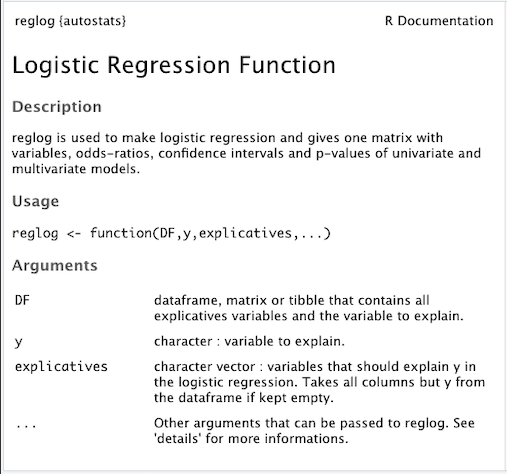

```{r setup, include=FALSE,cache=TRUE}
knitr::opts_chunk$set(echo = FALSE)
library(readr)
library(dplyr)
library(kableExtra)
library(knitr)
library(autostats)
library(magrittr)
library(tidyverse)
library(safeBinaryRegression)
source("R/table1.R")
source("R/progressbar.R")
source("R/dataprep.R")
source("R/logit.R")
source("R/multivariate_selection.R")

# Parmetres
###########
DF <- read_delim("data/thesepsyclean.csv",";", escape_double = FALSE, trim_ws = TRUE)[,-1]
y = "Récidive"
explicatives = colnames(DF)[colnames(DF) != y]
alpha = 0.05
verbose = TRUE
min_multivariate = 2
alpha_max = 0.2
round = 3
method = "backward"
rowstimevariable = 10
confirmation = TRUE
keep = FALSE
principal_factor = FALSE
##########

```


# Fonction reglog

```{r library autostats, echo=TRUE, results='hide'}
library(autostats)
?reglog
```





# Dataset d'example


<p>Thèse de psychiatrie dont l'objectif est la **détermination de facteurs de récidive de tentative de suicide chez l'enfant**.<br/><br/>
Nombre de variables : **`r length(DF) `** ; nombre de patients : **`r nrow(DF) `**</p>

```{r viewDF, echo=FALSE, message=FALSE, warning=FALSE}
library(readr)
library(dplyr)
library(kableExtra)
library(knitr)
library(autostats)
library(magrittr)
library(tidyverse)
library(safeBinaryRegression)
kableExtra::kable(DF) %>% kable_styling(bootstrap_options = c("condensed","stripped","hover","responsive"), full_width = F,font_size = 11, fixed_thead = T) %>% scroll_box(width = "90%",height = "50%")
cat(" ")
```


# Lancement de la fonction

Rmq : si 'explicatives' est laissé nul, l'argument prend toutes les colonnes du DF : <br>
explicatives = colnames(DF)[colnames(DF) != y]

<br/><br/><br/>


```{r lancement demo, echo=TRUE, message=FALSE, warning=FALSE, results='hide',error=FALSE}
#autostats::reglog(DF,y="Récidive")

```

<br><br>

DEMO 1


# Code source

# Verification des arguments / premières transformations

## DF et explicatives

- 'DF' doit être une dataframe ou cohercible en dataframe (matrix ou tibble)
- 'explicatives' doit faire partie des noms de colonnes de 'DF'
- y doit être une chaine de caractères, appartenant à DF
- y n'appartient pas à 'explicatives'

```{r verifs, echo=TRUE, message=FALSE, warning=FALSE}

   ##################################################
   #    Arguments verification / transformation     #
   ##################################################

   if (is.data.frame(DF) ||
       is.matrix(DF) ||
       is.tbl(DF))
   {
      DF <- as.data.frame(DF)
   } else {
      stop("No dataframe has been provided. Make sure 'DF' is a dataframe, a tibble or a matrix")
   }


   if (!is.vector(explicatives))
      stop("explicatives should be a vector of characters")

   #Removes explicatives not in DF
   explicatives_out_DF <- explicatives[!(explicatives %in% colnames(DF))]
   if (length(explicatives_out_DF) > 0)
   {
      msg_error <- explicatives_out_DF[1]
      if (length(explicatives_out_DF) > 1)
      {
         for (expl_out_DF in explicatives_out_DF[-1])
         {
            msg_error <- paste0(msg_error, ", ", expl_out_DF)
         }
         msg_error <- paste0(msg_error, " are not part of DF columns")
      } else{
         msg_error <- paste0(msg_error, " is not part of DF columns")
      }
      stop(msg_error)
   }


   if (!is.character(y) || !(y %in% colnames(DF)))
      stop("y must be a character variable, part of DF")

   if (y %in% explicatives)
   {
      message('y is part of "explicatives" and is removed from it')
      explicatives[-match(y, explicatives)]
   }


   if (!is.logical(verbose))
      stop("'verbose' must be logical")


   if (!is.numeric(min_multivariate))
      stop("min_multivariate must be numeric")


   if (!is.numeric(round) || round <= 0)
      stop("round must be numeric and positive")


   if (!(method %in% c("backward","forward","stepwise","PS")))
      stop("'method' should be one of this methods : backward, forward, stepwise, PS")

   if (!is.logical(confirmation))
      stop("'confirmation' must be logical")


   if (!is.logical(keep))
   {
      if (!is.character(keep) & !is.vector(keep))
         stop("keep should be a vector of character or characters")
      if (FALSE %in% (keep %in% explicatives))
         stop("some of keep elements are not in 'explicatives'")
   }

   ##################################################


```
   


# DATA CLEANING

Pour la suite, si verbose = TRUE, des informations sont présentées dans la console au cours du programme.
</br>Rmq : Les messages et errreurs ne sont pas passés sous silence si verbose = FALSE

```{r Data cleaning, echo=TRUE}
   ##################################################
   #               1) DATA CLEANING                 #
   ##################################################
   if (verbose) cat(
"\n\n\n\n\n
\n---+-----------------------------+-------------------------------------------------------------------------------------------
   |                             |
   |      1) DATA CLEANING       |
   |                             |
   +-----------------------------+\n
")

   DF <- data_prep_complete(DF,y,verbose = TRUE,keep)
   explicatives <- colnames(DF)[colnames(DF) != y]
   ##################################################
```


```{r data_prep, echo=TRUE, message=FALSE, warning=FALSE}
data_prep_complete <-
   function(DF,
            y,
            verbose = TRUE,
            keep = FALSE
   )
{
   verbose = T

   
   
   DF <- as.data.frame(DF)
   DF1 <- DF

   
   
   
   # Caractere preparation = removes all non-ASCII characteres
   DF <- format_data(DF)

   
   
   
   # Data prep of y = coerce y to a binary factor 0/1
   DF[,y] <- tobinary(DF[,y])


   
   
   # removes NAs
   DF <- NA_rm_for_glm(DF,y,keep = FALSE)

   
   
   
   # Cleans constant variables and converts numerics with few levels to factors
   DF <- checkforfactor(DF)

   if (verbose)
      cat("\n",(nrow(DF1) - nrow(DF))," rows deleted (",round(100*(nrow(DF1) - nrow(DF))/(nrow(DF1)),0),"%)","...........",nrow(DF),"rows remaining")

   explicatives <- colnames(DF)[colnames(DF) != y]

   if (verbose) cat("\n\nData cleaning is over.\n\nExplicatives variables remaining are :\n",explicatives,
   "It remains ",length(explicatives),"variables and ",nrow(DF),"observations
   \n\n+-----------------------------------------------------------------------------------------------------------------+\n")

   DF <- as.data.frame(DF)

   return(DF)
}
```


##  NA_rm_for_glm

On ne conserve que les lignes "complètes" (sans NA) pour conserver toujours la même population d'étude dans les différents modèles univariés et avec le modèle multivarié.

```{r delinting NA, echo=TRUE}
    # 1.3 Deleting row with NA in it
   ######
   DF_glm <- subset.data.frame(DF, select = c(y, explicatives))
   DF_complete <- DF_glm[complete.cases(DF_glm),]

   if (verbose) 
      cat("\nDropping all rows with NA in an explicative variable...\n",
          (nrow(DF_glm) - nrow(DF_complete))," rows deleted (",round(100*(nrow(DF_glm) - nrow(DF_complete))/(nrow(DF_glm)),0),"%)","...........",nrow(DF_complete),"rows remaining") 
   
```
   <br><br><br><br>
**Problème** : si il y a beaucoup de NA, risque de supprimer trop de lignes et de ne pas en laisser assez pour l'analyse.</br>
"Pas assez d'observations" est souvent considéré comme < 10 x variables explicatives restantes.<br><br>
**Solution** : supprimer une à une les colonnes avec le plus de NA<br><br><br>
**Risque** : supprimer des colonnes informatives, bien que pleines de NA<br><br><br>
**Piste** : methodes "pas à pas" préliminaire : construire n modèles de regression logistique univariées pour les n variables et supprimer les variables qui n'apportent pas d'information significative *par rapport au modèle nul (p > 0,5)* alors qu'elles ont toutes le maximum d'observations possibles.


# UNIVARIATE MODELS

```{r univariate,results='hide'}
try({
   ##################################################
   #            2) UNIVARIATE MODELS                 #
   ##################################################
   if (verbose) cat(
"\n
\n---+-----------------------------+--------------------------------------------------------------------------------------------
   |                             |
   |    2) UNIVARIATE MODEL      |
   |                             |
   +-----------------------------+\n
")


   # (...)
   vect_explicative = seq(50)

   for (var_uni in explicatives)
   {

      progressbar(total = length(vect_explicative),i,variable = var_uni)
      
      
      
      ##
      mod_uni <- logit(DF[,c(y,var_uni)])
      ##
      
      
      
      k = 0
      if (is.numeric(DF[, var_uni]))
      {
         i <- i + 1
         k <- k + 1
         ligneR <- getinfo_glm()
         vector_var[i] <- var_uni
         rslt[i + 1, ] <- c(ligneR[1:4], "-", "-", "-")
         row.names(rslt)[i + 1] <- paste0(var_uni,ligneR[5])
      } else{
         while (k + 1 < length(levels(DF[, var_uni]))) {
            i <- i + 1
            k <- k + 1
            ligneR <- getinfo_glm()
            vector_var[i] <- var_uni
            rslt[i + 1, ] <- c(ligneR[1:4], "-", "-", "-")
            row.names(rslt)[i + 1] <- paste0(var_uni,ligneR[5])
         }
      }
   }


   if (verbose) cat("
------------------------------------------------------------------------------------------------------------------------------
                   ")
   ##################################################
})
```

## Fonction logit

```{r}
logit <- function(DF,y = colnames(DF)[1], response = FALSE, auto=TRUE){

   # 1) Getting the elements
   ##################################################
   formule <- formulation(DF,y)
   #####


   # 2) Verify conditions and transformation
   ##################################################
   if (!is.factor(DF[, y]))
   {
      DF <- as.data.frame(DF)
      DF[,y] <- tobinary(DF[, y])
   }
   #####


   # 3) Regression
   ##################################################
   error_glm <- TRUE
   response <- FALSE
   firth_method <- FALSE

   while (error_glm)
   {
      tryCatch(
      {
         error_glm <- FALSE
         model <- glm(formule, data = DF, family = "binomial")
      },
      error = function(er)
      {
         error_glm <- TRUE
         if (grepl("separation", er))
         {
            if (verbose)
               cat("\nComplete or quasi complete separation occured for : ")
            for (var in colnames(DF)[-1])
            {
               if (verbose)
                  cat("\n- ", var)
            }
            if (!auto)
            {
               DF <- complete_separation(var, y, DF, continue = response)
            } else
            {
               firth_method = TRUE
               error_glm <- FALSE
               DF$continue <- " "
               DF$method <- "firth"
            }
            response <- DF$continue[1]
            DF$continue <- NULL
            if (DF$method[1] == "firth")
            {
               if (verbose)
                  cat("\n logistic regression using Firth's Bias-Reduced Logistic regression has been performed\n")
               firth_method = TRUE
               error_glm <- FALSE
            }
            DF$method <- NULL
         }else
         {
            stop(er)
         }
      })
   }

      #####

   logistf::logistf(formule, data = DF,firth = firth_method, pl = FALSE) -> model
   return(model)
}

```

# Modèle multivarié

```{r}
multivariate_selection <-
   function(DF,
            y,
            explicatives = colnames(DF)[colnames(DF) != y],
            keep=FALSE,
            principal_factor=FALSE,
            method = "backward",
            criteria = "AIC",
            check_interactions = FALSE,
            alpha = 0.05,
            verbose=TRUE)
   {


      source("R/formulation.R")

      var_to_formula <- function(vars, y)
      {
         formule <- vars[1]
         for (t in 2:length(vars))
         {
            formule <- paste0(formule,"+", vars[t])
         }
         formule <- paste0(y, "~", formule)
         formule <- formula(formule)
         return(formule)
      }


      # MODEL 0
      if ("forward" %in% method)
      {
         formule <- formula(paste0(y,"~",1))
         model0 <- glm(formule,family = "binomial",data = DF) # NULL MODEL
      }
      if ("backward" %in% method)
         model0 <- logit(DF[, c(y, colnames(DF)[colnames(DF) != y])]) # FULL MODEL


   explicatives_multi_test <- c("null model",explicatives)


   # BACKWARD MODEL
   ##############################
   if ("backward" %in% method)
   {

      #Determination of the principal factor : specified or determined by the variable for which the deviance is the smallest
      if (!is.logical(principal_factor))
      {
         if (!(principal_factor %in% explicatives))
            stop("the principal factor must be in 'explicatives'")
         if (verbose)
            cat("\nFirst variable set is <",principal_factor,">\n because it is the principal factor specifed")
         principal_factor -> keep[length(keep) + 1]
      }
      if (is.logical(principal_factor))
      {
         # Determination of p-val vs anova for all elements
         models1 <- data.frame(row.names = explicatives_multi_test)
         for (j in seq(explicatives_multi_test))
         {
            if (j == 1)
            {
               model1 <- stats::glm(DF[ ,y]~1, family = "binomial")
            } else
            {
               model1 <- stats::glm(DF[ ,y]~DF[, explicatives_multi_test[j]], family = "binomial")
            }
            models1$deviance[j] <- model1$deviance
         }
         principal_factors <- models1[order(models1$deviance),,drop = FALSE]
         principal_factor <- rownames(principal_factors)[1]
         if (verbose)
            cat("\nFirst variable set is <",principal_factor,">\n because the model with this variable is better than all other models with 0 (null model) or 1 variable\n")

      }


      explicatives_remains <- explicatives[explicatives != principal_factor]
      formule <- formula(paste0(y,"~",principal_factor))
      model1 <- logit(DF)


      # Determination of interactions
      if (check_interactions)
      {
         interact_table <-  data.frame(row.names = explicatives_remains)
         for (i in seq(explicatives_remains))
         {
            formule1 <- paste(y, "~", principal_factor, "+", explicatives_remains[i])
            formule2 <- paste(formule1, "+", principal_factor, ":", explicatives_remains[i])
            formule1 <- formula(formule1)
            formule2 <- formula(formule2)
            model_interact <- glm(formule2,data = DF, family = "binomial")
            anova <- anova(model_interact,test = "LRT")
            pvalue <- anova$Pr[4]
            interact_table$pval[i] <- pvalue
         }
         interact_table <- interact_table[order(interact_table$pval),,drop = FALSE] #df with all p-values of likelihood ratio test between model with and without interaction
         signif_interact_table <- row.names(interact_table)[interact_table[,1] < 0.05]
         for (j in seq(signif_interact_table))
         {
            signif_interact_table[j] <- paste0(principal_factor,":",signif_interact_table[j])
         }
         interactives_remains <- signif_interact_table
      }


      # Backward selection for interaction
      if (check_interactions)
      {
         if (length(interactives_remains) > 0)
         {
            for (i in seq(interactives_remains))
            {
               formule <- formulation(DF[,c(y,explicatives_remains)])
               for (i in seq(interactives_remains))
               {
                  interactive_formule <-
                     ifelse(i == 1, interactives_remains[i], paste0("+", interactives_remains[i]))
               }
               newterms <- interactive_formule
               formule <- update(formule, ~ . + newterms)
               model0 <- stats::glm(formule, data = DF, family = "binomial")
               pvals <- summary(model0)$coefficients[,4]

               #Elimination one by one of all interaction variable based on PVALUE
               interact_pval <- pvals[match(interactives_remains,names(pvals))]
               interact_pval <- interact_pval[order(-interact_pval)]
               if (interact_pval[1] > alpha)
               {
                  interactives_remains <- interactives_remains[interactives_remains != names(interact_pval)]
               }
            }
         }
      }


      vars_remainings <- explicatives
      last_model <- logit(DF[,c(y,vars_remainings)])


      #Backward selection for all variables
      #####
      # Test 2 models // return p-val of the test corresponding to "critere
      ## CRITERIA
      # 1. significance criteria =to compare the log-likelihoods of 2 nested models : the variable with the
         # A. Wald test : only if there is 1 difference
         # B. Score test : only if there is 1 difference
         # C. Loglikelihood ratio test : to be prefered if multiple coeffs are tested => only valable way
      # 2. information criteria
      models_test <- function(model,
                              y,
                              var_diff,
                              critere_choix = "AIC")
      {
         if (!(critere_choix %in% c("deviance", "AIC", "BIC")))
            stop("criteria is not on the list")

         if (critere_choix == "deviance")
         {
            formule_diff_terms <- model$terms
            formule_diff_terms <- formule_diff_terms[formule_diff_terms != var_diff]
            formule_diff <- var_to_formula(formule_diff_terms,y)
            model2 <- stats::glm(formule_diff, data = DF, family = "binomial")
            anova_test <- anova(model, model2, test = "LRT")
            pval <- anova_test$Pr[nrow(anova_test)]
         }

         if (critere_choix == "AIC")
         {
            formule_diff_terms <- model$terms
            new_formula <-  paste0(y,"~")
            int = 0
            formule_diff_terms <- formule_diff_terms[-grep(var_diff,formule_diff_terms)]

            for (var in explicatives)
            {
               if (TRUE %in% (grepl(var, formule_diff_terms)))
               {
                  int <- int + 1
                  new_formula <- ifelse(int == 1, paste0(new_formula, var), paste0(new_formula, "+", var))
               }

            }
            new_formula <- formula(new_formula)
            firth_method <- ifelse(model$method == "Standard ML",FALSE,TRUE)
            model2 <- update(model,new_formula)
            delta_AIC <- extractAIC(model)[2] - extractAIC(model2)[2]
         }

         return(delta_AIC)
      }


      while (length(vars_remainings) > 0)
      {
         model_test_df <- matrix(nrow = length(vars_remainings), ncol = 2)
         for (i in seq(vars_remainings))
         {
            pval <- models_test(model = last_model, y, var_diff = vars_remainings[i])
            model_test_df[i,] <- c(vars_remainings[i],pval)
         }
         model_test_df <- as.data.frame(model_test_df)
         colnames(model_test_df) <- c("name","pval")
         model_test_df$pval <- as.numeric(as.character(model_test_df$pval))
         model_test_df$name <- as.character(model_test_df$name)
         model_test_df[order(-model_test_df$pval),] -> model_test_df


         k <- 1
         while (model_test_df[k,1] %in% keep)
         {
            k <- k + 1
         }


         if (model_test_df[k,2] > ifelse(criteria == "deviance",alpha,10))
         {
            if (verbose)
               cat("\nThe best model exlude <",model_test_df[k,1], "> (",ifelse(criteria == "deviance","with likelihood ratio test : p =","with ∆AIC ="),round(as.numeric(model_test_df[k,2]),3),"), so this variable is now excluded")
            vars_remainings <- vars_remainings[vars_remainings != model_test_df[k,1]]
         }
         else
         {
            if (verbose)
               cat("\nThe best model do not exlude any variable of the variables remaining (",ifelse(criteria == "deviance",paste0("with risk",alpha),"with ∆AIC threeshold = 10"),"):",vars_remainings)
            break
         }
      }

      return(vars_remainings)
      #####
   }

}
```

