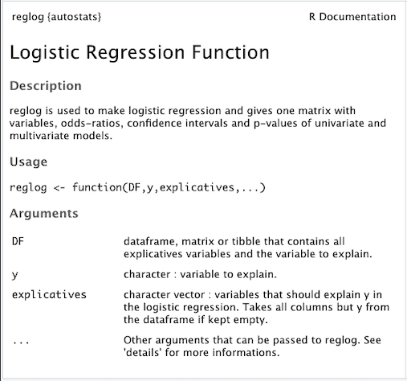

```{r setup, include=FALSE,cache=TRUE}
knitr::opts_chunk$set(echo = FALSE)
library(readr)
library(kableExtra)
library(knitr)
library(autostats)
library(tidyverse)
#library(safeBinaryRegression)
source("../R/table1.R")
source("../R/progressbar.R")
```


# Fonction reglog

```{r library autostats, echo=TRUE}
library(autostats)
?reglog
```




# Dataset d'example

```{r data importation, message=FALSE, warning=FALSE, include=FALSE}
DF <- read_delim("../data/thesepsyclean.csv",";", escape_double = FALSE, trim_ws = TRUE)[,-1]
```

<p>Thèse de psychiatrie dont l'objectif est la **détermination de facteurs de récidive de tentative de suicide chez l'enfant**.<br/><br/>
Nombre de variables : **`r length(DF) `** ; nombre de patients : **`r nrow(DF) `**</p>

```{r viewDF, message=FALSE, warning=FALSE}
opts_chunk$set( fig.align='center')
DF %>%
   kable() %>%
   kable_styling(bootstrap_options = c("condensed","stripped","hover","responsive"), full_width = F,font_size = 11, fixed_thead = T) %>%
   scroll_box(width = "70%",height = "50%")
```


# Lancement de la fonction

```{r variables, echo=FALSE}
y="Récidive"
explicatives = colnames(DF)[colnames(DF) != y]
alpha = 0.05
verbose = TRUE
min_multivariate=2
alpha_max=0.2
round = 3
method = "forward"
rowstimevariable = 10
confirmation = FALSE
```

Rmq : si 'explicatives' est laissé nul, l'argument prend toutes les colonnes du DF : <br>
explicatives = colnames(DF)[colnames(DF) != y]


```{r lancement demo, echo=TRUE, message=TRUE, warning=TRUE}
#rslt <- reglog(DF,y="Récidive")
#rslt
```


# Code source

# Verification des arguments / premières transformations

## DF et explicatives

- 'DF' doit être une dataframe ou cohercible en dataframe (matrix ou tibble)
- 'explicatives' doit faire partie des noms de colonnes de 'DF'

```{r verifs, echo=TRUE}

   ##################################################
   #    Arguments verification / transformation     #
   ##################################################


   if (is.data.frame(DF) || is.matrix(DF) || is.tbl(DF)){
      DF <- as.data.frame(DF)
   } else{
      stop("No dataframe has been provided. Make sure 'DF' is a dataframe, a tibble or a matrix")
   }
   


   if (!is.vector(explicatives))
      stop("explicatives should be a vector of characters")

   explicatives_out_DF <- explicatives[!(explicatives %in% colnames(DF))] 
   if(length(explicatives_out_DF) > 0){
      msg_error <- explicatives_out_DF[1]
      if(length(explicatives_out_DF) > 1){
         for (expl_out_DF in explicatives_out_DF[-1]){
         msg_error <- paste0(msg_error,", ",expl_out_DF)
         }
         msg_error <- paste0(msg_error," are not part of DF columns")
      }else{
         msg_error <- paste0(msg_error," is not part of DF columns")
      }
      stop(msg_error)
   }


```
   
## y
   
- y doit être une chaine de caractères, appartenant à DF
- y n'appartient pas à 'explicatives'
- DF$y ne contient pas de NA
- DF$y est un facteur sous forme binaire 0 ou 1 (ou être cohercible; avec par défaut le niveau "non","no ","not " = 0)

```{r verifs2, echo=TRUE}

   #
   # y must be a character that leads to a Bernoulli variable (binary code, 1 as event, 0 as no event, no NA) in DF
   # If not, it is coerce or stop
   #


   if (!is.character(y) ||!(y %in% colnames(DF)))
      stop("y must be a character variable, part of DF")


   
   if (y %in% explicatives) {#if y is in 'explicatives' it is deleted
      message('y is part of "explicatives" and is removed from it')
      explicatives[-match(y, explicatives)]
   }


   DF <- DF[!is.na(DF[, y]), ] # we remove all NA in DF$y

   
      
   # Re-encoding Y
   levels_y <- levels(as.factor(DF[, y])) #we get the levels of y (that should be 0 or 1)
   if (length(levels_y) != 2)
      stop("y should be a factor with 2 levels")
   if (FALSE %in% (levels_y %in% c(0,1))){
      DF[, y] <- as.character(DF[, y]) # prevents errors if DF[,y] is a factor
      stringr::str_detect(levels_y, "non") -> non_position
      stringr::str_detect(levels_y, "no ") -> no_position
      stringr::str_detect(levels_y, "not ") -> not_position
      if(non_position || no_position || not_position){#if there is a level with "no " or "non" or "not " in it, it will be the 0 level
         if(!is.na(match(TRUE,non_position))) match(TRUE,non_position) -> level_non
         if(!is.na(match(TRUE,no_position))) match(TRUE,no_position) -> level_non
         if(!is.na(match(TRUE,not_position))) match(TRUE,not_position) -> level_non
            DF[, y][DF[, y] == levels_y[level_non]] <- 0
            DF[, y][DF[, y] != 0] <- 1
         }else{#else it will be the first that will be 0
            DF[, y][DF[, y] == levels_y[1]] <- 0
            DF[, y][DF[, y] == levels_y[2]] <- 1
         }
   if(verbose)
      cat('\ny has been changed to 0/1 factor with ',levels_y[1],' = 0 and ',levels_y[2],' = 1')
   }
   DF[, y] <- as.factor(DF[, y])
```

## Autres paramètres

```{r verifs3, echo=TRUE}

#
# Other params
#

   if (!is.logical(verbose))
      stop("'verbose' must be logical")


   if (!is.numeric(min_multivariate))
      stop("min_multivariate must be numeric")


   if (!is.numeric(round) || round <= 0)
      stop("round must be numeric and positive")


   if (!(method %in% c("backward","forward","stepwise","PS")))
      stop("'method' should be one of this methods : backward, forward, stepwise, PS")

   if(!is.logical(confirmation))
      stop("'confirmation' must be logical")


   ##################################################
```


# DATA CLEANING

Pour la suite, si verbose = TRUE, des informations sont présentées dans la console au cours du programme.
</br>Rmq : Les messages et errreurs ne sont pas passés sous silence si verbose = FALSE

```{r echo=TRUE}
   ##################################################
   #               1) DATA CLEANING                 #
   ################################################## 
   if (verbose) cat(
         "\n\n+-----------------------------+\n",
         "  1) DATA CLEANING :",
         "\n+-----------------------------+\n")
```


##  1.1 Clean constant variables

Les variables constantes (1 seul niveau si facteur) sont supprimées.<br/>

```{r echo=TRUE}

   # 1.1 Clean constant variables
   ######
   explicatives_1 <- explicatives

   for (var_i in length(explicatives):1) {
      # Check for each variable 'var' in explicatives :
      # if numeric variable is constant or if factor as only one level
      # and then deleate it if so
      var <- explicatives[var_i]
      if (is.numeric(DF[,var])) {
         as.factor(DF[,var]) -> DF[,var]
         if (length(levels(DF[, var])) < 2) {#removes factor with only one level
            if (verbose) message("\n", var, " is constant and is deleted")
            explicatives <- explicatives[-var_i]
         }
         rep <- "N"
         if (length(levels(DF[, var])) < 7) {
            message("\n", var, " is a numeric variable with only",length(levels(DF[, var]))," different values and could be considered as a factor")
            if(confirmation){
               rep <- readline(paste0("Change",var,"into factor ? O/N"))
            }else{rep <- "O"}
            if(rep != 'O')as.numeric(DF[,var])
         }
      }else{
         #convert each non numeric into a factor and check whether they have one level or not
         as.factor(DF[,var]) -> DF[,var]
         if (length(levels(DF[, var])) < 2) {
            #removes factor with only one level
            if (verbose)
               message("\n", var, " has only one level and is deleted")
            explicatives <- explicatives[-var_i]
         }else{}
      }
   }
   ######
```


##  1.2 Deleting row with NAs

On ne conserve que les lignes "complètes" (sans NA) pour conserver toujours la même population d'étude dans les différents modèles univariés et avec le modèle multivarié.

```{r delinting NA, echo=TRUE}
    # 1.3 Deleting row with NA in it
   ######
   DF_glm <- subset.data.frame(DF, select = c(y, explicatives))
   DF_complete <- DF_glm[complete.cases(DF_glm),]

   if (verbose) 
      cat("\nDropping all rows with NA in an explicative variable...\n",
          (nrow(DF_glm) - nrow(DF_complete))," rows deleted (",round(100*(nrow(DF_glm) - nrow(DF_complete))/(nrow(DF_glm)),0),"%)","...........",nrow(DF_complete),"rows remaining") 
   
```
   <br><br><br><br>
**Problème** : si il y a beaucoup de NA, risque de supprimer trop de lignes et de ne pas en laisser assez pour l'analyse.</br>
"Pas assez d'observations" est souvent considéré comme < 10 x variables explicatives restantes.<br><br>
**Solution** : supprimer une à une les colonnes avec le plus de NA<br><br><br>
**Risque** : supprimer des colonnes informatives, bien que pleines de NA<br><br><br>
**Piste** : methodes "pas à pas" préliminaire : construire n modèles de regression logistique univariées pour les n variables et supprimer les variables non significatives (quel seuil ? interactions ?) alors qu'elles ont toutes le maximum d'observations possibles.
